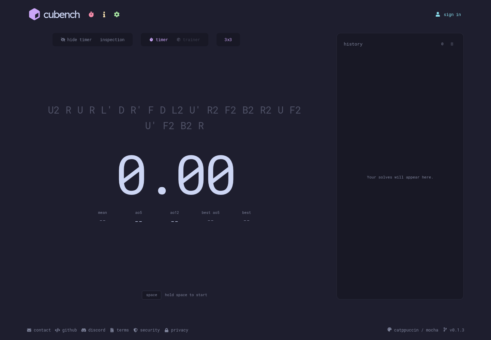
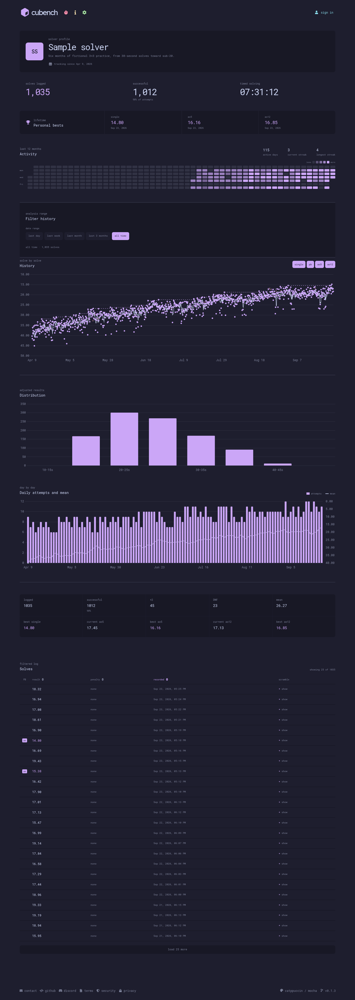

# Cubench

A visually pleasing, keyboard-first 3×3 speedcubing timer with solve history and progress
tracking. Built with React, TypeScript, FastAPI, and SQLite.

**[Try it](https://cubench.hugorouillard.dev/)** ·
**[Explore account features](https://cubench.hugorouillard.dev/#preview)** ·
[Report a bug or share feedback](https://github.com/hugorouillard/cubench/issues)



## About the project

The goal is a speedcubing timer with two main benefits:

1. works immediately without requiring you to set up a particular workflow to get useful progression stats.
2. its behavior and visuals are highly configurable while still having sensible defaults.

## Try it without an account

- **Time solves:** hold **Space** until the timer says “release to start,”
  release to start, then press **Space** again to stop. You can try the timer
  without a cube. **Escape** stops a running solve as a DNF (did not finish).
- **Explore progress tracking:** open the **sign in** dialog and choose
  **preview account features** to browse a read-only profile with fictional
  solves. Date filters, chart series, and sortable history work without signing in.

Guest solves stay in memory for the current visit and are lost on refresh or
when the page is closed. The preview's sample data is separate from your solves.

Accounts save new solves across visits and devices, and provide a personal
dashboard and JSON export. Registration is currently invite-only during this
small feedback phase. **[Request an invite from Hugo](mailto:rouillard.hugo1@gmail.com?subject=Cubench%20invite%20request)**
if you'd like to use an account. Signing in starts a fresh timer session;
guest solves are not transferred.

<details>
<summary>See the account dashboard (fictional sample data)</summary>



</details>

## What's implemented

- Random-state 3×3 scrambles using **cubing.js**.
- Hold-to-start timer, optional inspection with automatic penalties, and a
  hide-timer option.
- Solve history with mutually exclusive `+2` / `DNF` penalties and deletion.
- Mean, best single, and current/best averages of 5 and 12 solves (`ao5` / `ao12`).
  Averages discard one best and one worst result; a remaining DNF invalidates
  the average.
- Account profiles with personal bests, activity heatmap, streaks, history
  charts, time distribution, and daily summaries.
- Date filtering, sortable solve history, editable profile details, and JSON
  account-data export.
- Theming.

## How it's built

```text
React + TypeScript
  ├── timer and scramble generation in the browser
  ├── guest solves and fictional preview data in memory
  └── signed-in requests over /api
        └── FastAPI + Pydantic
              └── SQLite: accounts, auth sessions, solves
```

Notes:

- **Timing stays in the browser.** [`useTimer.ts`](web/src/useTimer.ts) uses
  explicit timer phases and `performance.now()` for elapsed time;
  `requestAnimationFrame` updates the display. The API only receives completed
  solves.
- **Guest and account storage share a small interface.**
  [`solveStore.ts`](web/src/solveStore.ts) keeps the timer flow the same for both.
  Failed saves retain the result for retry, and client-generated solve IDs let
  the API recognize repeated submissions.
- **Statistics are pure TypeScript functions.**
  [`stats.ts`](web/src/stats.ts) calculates averages and chart data from solves,
  with tests for penalty handling, date ranges, and personal bests. The account
  preview uses the same dashboard and calculations as a real account.
- **A small backend fits the current scope.** FastAPI uses Python's `sqlite3`
  module directly. Queries are scoped to the signed-in account. Passwords are
  hashed with scrypt. Authentication uses an HttpOnly session cookie and hashed
  session tokens stored in SQLite.

The frontend uses plain CSS and Chart.js. The live app runs on a VPS with Caddy
serving the frontend and proxying API requests to Uvicorn.

## Planned

- [ ] Finer tracking: support other puzzles/events, named sessions and trainer mode (algs, cross only, LL, BLD execution, etc.).
- [ ] Timer and profile UIs customization. Behavior and visual customization will become
      the focus once the main features are stable.
- [ ] Stackmat / Smartcubes integration.
- [ ] Export/import solve stats.
- [ ] Share/import config settings.

## Run locally

### Requirements

- Node.js 24 or newer
- Python 3.12 or newer
- [uv](https://docs.astral.sh/uv/)
- [just](https://just.systems/)

### Setup

From a fresh clone:

```bash
git clone https://github.com/hugorouillard/cubench.git
cd cubench
cp .env.example .env
```

In `.env`, replace `CUBENCH_INVITE_CODE` with a code of your choosing to enable
local registration. Enter that same code in the app's **create account** form.
The placeholder value leaves account registration disabled; the guest timer
and sample preview still work.

```bash
just install
just dev
```

### Checks

```bash
just check
```

This runs the pytest API/database tests, Oxlint, Vitest/React Testing Library
tests, TypeScript checking, and the Vite production build. GitHub Actions runs
the same checks on pull requests and pushes to `master`.
