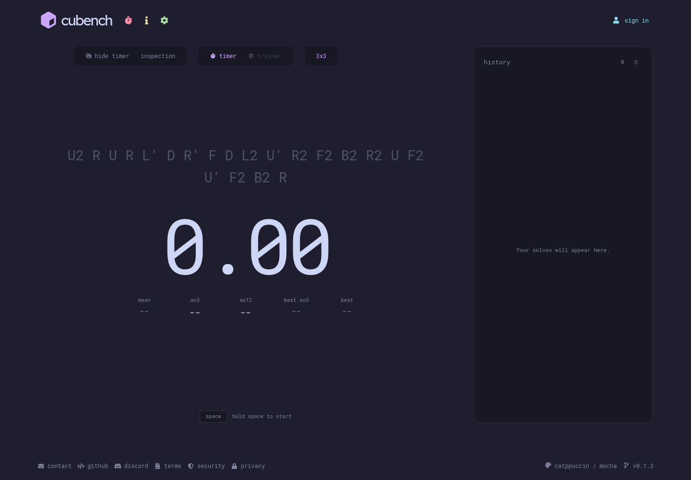
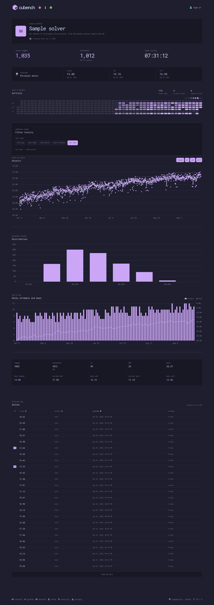

# Cubench

A visually pleasing 3×3 speedcubing timer with solve history and progress
tracking. Built with React, TypeScript, FastAPI, and SQLite.

**[Try it](https://cubench.hugorouillard.dev/)** ·
**[Explore account features](https://cubench.hugorouillard.dev/#preview)** ·
**[Report a bug or share feedback](https://github.com/hugorouillard/cubench/issues)**



## About the project

The goal is a speedcubing timer with two main benefits:

1. works immediately without requiring you to set up a particular workflow to get useful progression stats.
2. its behavior and visuals are highly configurable while still having sensible defaults.

## Try it now

- **Time solves:** hold **Space** until the timer says “release to start,”
  release to start, then press **Space** again to stop. You can try the timer
  without a cube. **Escape** stops a running solve as a DNF (did not finish).
- **Explore progress tracking:** open the **sign-in page** and choose
  **preview account features** to browse a read-only profile with fictional
  solves. Date filters, chart series, and sortable history work without signing in.

Guest solves stay in memory for the current visit and are lost on refresh or
when the page is closed. The preview's sample data is separate from your solves.

Accounts save new solves across visits and devices, and provide a personal
dashboard and JSON export. Registration is currently invite-only during this
small feedback phase. **[Request an invite](mailto:rouillard.hugo1@gmail.com?subject=Cubench%20invite%20request)**
if you'd like to use an account. Signing in starts a fresh timer session;
guest solves are not transferred.



## Development

### Requirements

- Node.js 24 or newer
- Python 3.12 or newer
- [uv](https://docs.astral.sh/uv/)
- [just](https://just.systems/)

### Setup & Useful commands

```bash
git clone https://github.com/hugorouillard/cubench.git
cd cubench
cp .env.example .env
```

In `.env`, replace `CUBENCH_INVITE_CODE` with a code of your choosing to enable
local registration. Enter that same code in the app's **create account** form.

For testing with a real account, development mode automatically creates one
with the **same sample solve history as the preview**. Run the app and sign in
at `/login` with username `cubench_dev` and password `dev-password`.

```bash
just install   # install deps
just dev       # start dev instance
just check     # run code checks
```
